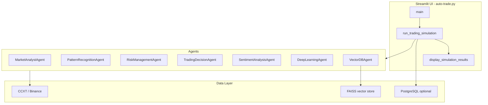

# Codebase Review — Xelora Trading (Screening Sample)

**Reviewer:** Pulkit Chadha  
**Repository:** https://github.com/PulkitChadha125/Xelora-Trading  
**Date:** May 21, 2026  
**Scope:** Google Drive sample codebase (AMAAI Multi-Agent Trading System)

---

## Executive Summary

This repository is a **Python + Streamlit crypto trading simulation** with multi-agent orchestration (technical analysis, sentiment, risk, optional deep learning and vector DB). It is a **research/demo prototype**, not a production forex OMS like the long-term **Xelora Trading** vision described in the job description.

The codebase shows solid product thinking (rich UI, agent transparency, P&L display, sentiment correlation) but has **structural and operational gaps** that would block production deployment: a single 4,100+ line module, dependency/version drift, secrets committed to git history, and tests that are partly out of sync with the application.

During this review I also applied **small runtime fixes** so the Streamlit app starts on a typical Windows dev machine without PostgreSQL or LangChain 0.2.x (see [Changes Made](#changes-made-in-this-review-commits)).

**Verdict:** Strong prototype for demos and hiring evaluation; requires a phased refactor before it can serve as the foundation for a secure, multi-exchange trading platform.

---

## Architecture Overview



| Layer | Implementation | Notes |
|-------|----------------|-------|
| Entry point | `main()` → Streamlit widgets | UI and business logic are tightly coupled |
| Simulation | `run_trading_simulation()` | Bar-by-bar backtest, not live order routing |
| Market data | `fetch_binance_ta()` | CCXT with simulated fallback |
| Decision | `TradingDecisionAgent` + LangChain `AgentExecutor` | OpenAI-dependent |
| Persistence | `save_simulation_result()` (session), `save_results_to_db()` (log only) | PostgreSQL optional via `ENABLE_DATABASE`; **past results work without DB** |
| Display | `display_simulation_results()` | Trade log, charts, sentiment timeline |

**Key classes:** `TradingConfig`, `TradingDecisionAgent`, `SentimentAnalysisAgent`, `VectorDBAgent`, `execute_trade()`, `fetch_binance_ta()`.

---

## Strengths

1. **Feature-rich demo** — Multi-agent pipeline, reasoning display, sentiment timeline, performance summary, past results.
2. **Risk configuration** — Conservative / moderate / aggressive presets with position sizing and confidence thresholds.
3. **P&L display logic** — `format_profit_pct()` correctly forces `0.00%` when profit is near zero (lines ~1644–1658).
4. **Graceful optional deps** — TensorFlow, FAISS, sentiment libs wrapped in try/except with fallbacks.
5. **Documentation effort** — README is detailed (install, architecture, troubleshooting).
6. **Test intent** — Multiple scripts target real concerns (P&L, chart keys, DB, date filters).

---

## Issues Found (Verified)

### P0 — Blocks running on a clean environment

| Issue | Evidence | Impact | Status in review repo |
|-------|----------|--------|------------------------|
| **LangChain API breakage** | `AgentExecutor` removed from `langchain.agents` on LangChain **1.x** | App crashed on `streamlit run` with `ImportError` | **Fixed** — import fallback via `langchain-classic`; removed unused `langchain_core.pydantic_v1` import |
| **PostgreSQL required at startup** | `init_database()` ran on import; `pg_conn()` called `st.error()` when localhost:5432 refused | Large red errors even though DB is optional; `save_results_to_db()` only logs JSON | **Fixed** — `ENABLE_DATABASE=false` by default; no connection attempt unless enabled |
| **`.env` was tracked in git** | Present in initial commit | Secret leakage risk if real keys are ever added | **Fixed** — untracked; use `.env.example` |
| **No `.gitignore` / `.env.example`** | Claimed in `summary.md` but missing from Drive drop | Poor onboarding and security hygiene | **Fixed** — both added |

### P1 — Correctness / maintainability

| Issue | Evidence | Impact |
|-------|----------|--------|
| **Stale Streamlit key tests** | `test/final_key_test.py` tests `trading_chart_*` key pattern; `auto-trade.py` has only one `st.plotly_chart()` **without** a `key=` argument | Test passes on isolated logic but does not validate production UI; duplicate-element errors may still occur in loops (`for i, sentiment`, `for i, result`) |
| **Sentiment “variety” is synthetic** | Lines ~1783–1822 add time context strings; same `base_text` is reused | UX improvement, not true deduplication of social posts |
| **Monolithic file** | ~4,135 lines in `auto-trade.py` | Hard to test, review, and deploy independently |
| **Tests use deprecated pandas freq** | `freq='H'` in `test_runner.py` / `test_quick_validation.py` | Fails on pandas 2.x (`Did you mean h?`) |
| **README placeholders** | `yourusername`, generic clone URLs | Not production-ready repo metadata |

### P2 — Production / Xelora gap

| Issue | Notes |
|-------|-------|
| Simulation vs execution | No order gateway, fill confirmation, or idempotent order IDs |
| Crypto-only | CCXT/Binance; JD describes multi-currency / multi-exchange forex |
| No WebSocket feed layer | REST/polling style; not low-latency market data |
| Heavy ML stack | TensorFlow + FAISS for optional features increases install size and CI time |
| No CI pipeline | Ad-hoc test scripts, no GitHub Actions / unified pytest gate |

---

## Test Results (This Review)

Environment: Windows, Python 3.12, project venv with core packages installed.

| Test / check | Result | Notes |
|--------------|--------|-------|
| `streamlit run auto-trade.py` (UI load) | **Pass** (after fixes) | LangChain import + optional DB; sidebar shows status without connection refused banner |
| `auto-trade.py` module import | **Pass** (after fixes) | Requires `pip install langchain-classic` on LangChain 1.x |
| `test/test_quick_validation.py` | **Partial** | Imports succeed after LangChain fix; may still fail on pandas `freq='H'` on pandas 2.x |
| `test/test_runner.py` | **Partial** | Import tests pass after fix; `test_05` fails on `freq='H'` |
| `test/final_key_test.py` | **Pass** | Key-generation algorithm is unique; not wired to actual chart widgets |
| `summary.md` claim “100% tests” | **Not reproduced** | Original Drive drop + unpinned deps |

### Local run requirements (after review fixes)

```bash
pip install -r requirements.txt
pip install langchain-classic   # if using LangChain 1.x
cp .env.example .env            # set OPENAI_API_KEY for simulations
# ENABLE_DATABASE=false by default — no PostgreSQL needed
streamlit run auto-trade.py
```

Open `http://localhost:8501`. Use **View Past Results** for history in the current browser session (no DB).

---

## Security & Operations

- **Secrets:** `.env` contained placeholder keys but was committed; must stay out of git (`.gitignore` added in this review).
- **API keys:** OpenAI key required for full agent path; no key rotation or vault integration.
- **Database:** PostgreSQL is optional (`ENABLE_DATABASE=true` to enable). Original code attempted connection on every app load and surfaced errors in the main UI even though persistence for “past results” is already handled in Streamlit session state. `save_results_to_db()` does not write to Postgres — it only logs JSON.
- **Logging:** `logging` used; no structured logs, metrics, or alerting for trading failures.
- **Deployment:** Streamlit single-process model; not suitable for HA execution without splitting backend.

---

## Gap Analysis: Sample vs Xelora Trading JD

| Xelora JD expectation | This sample |
|----------------------|-------------|
| Real-time order execution | Simulated trades in memory |
| Multi-exchange forex integrations | Binance/CCXT crypto |
| Robust API for third parties | Streamlit UI only |
| Security protocols (audit, RBAC) | None |
| WebSocket market data | Not present |
| Automated strategies at scale | Single-user simulation loop |
| OMS reliability (retries, state) | Session state + optional DB |

**Bridge recommendation:** Treat this repo as a **UI/AI prototype layer**; build Xelora core as separate services (market data, OMS, risk, API gateway) and optionally embed or replace the Streamlit front end later.

---

## Prioritized Recommendations

### P0 (Immediate)

1. ~~Pin LangChain / add `langchain-classic` shim~~ — done in review repo; upstream should adopt the same pattern or pin `langchain<0.3`.
2. ~~Keep `.env` out of git; document `ENABLE_DATABASE`~~ — done in review repo.
3. Add CI job: `pip install -r requirements.txt` + `pytest` or unified test runner.
4. Document in README that PostgreSQL is optional and session storage is the default for past results.

### P1 (Short term)

1. Split `auto-trade.py` into `agents/`, `data/`, `ui/`, `services/`.
2. Add explicit `key=` to all Streamlit widgets inside loops.
3. Fix pandas `freq='h'` in tests; align tests with real chart key usage.
4. Replace synthetic sentiment duplication with dedupe by `post_id` or content hash.

### P2 (Xelora platform)

1. Order management service with idempotent client order IDs.
2. WebSocket ingest + normalized tick/bar schema.
3. Exchange adapter interface (Binance, Bybit, etc.) behind one API.
4. Structured audit logs and monitoring (Prometheus/Grafana or equivalent).

---

## Changes Made in This Review (Commits)

| Change | Purpose |
|--------|---------|
| Added `.gitignore` | Exclude `.env`, venv, caches, secrets |
| Added `.env.example` | Safe template; includes `ENABLE_DATABASE=false` |
| Removed `.env` from git tracking | Prevent accidental secret push |
| Added `FEEDBACK.md` | CTO-facing review (this document) |
| Added `UPWORK_HANDOFF.md` | Short message template for client |
| **LangChain 1.x compatibility** | `try/except` import from `langchain_classic.agents`; added `langchain-classic` to `requirements.txt`; removed broken `pydantic_v1` import |
| **PostgreSQL optional by default** | `is_database_enabled()` + `ENABLE_DATABASE`; no `st.error()` on failed DB at import; friendly status in System Status sidebar |
| Pinned / documented LangChain in `requirements.txt` | Reduce “works on my machine” install failures |

No large refactor of `auto-trade.py` was performed beyond these startup/runtime fixes — scope remained analysis, repository hygiene, and making the demo runnable locally without PostgreSQL.

---

## Conclusion

The team has delivered an **impressive AI trading demo** suitable for showcasing multi-agent decision-making and sentiment-aware backtests. For **Xelora Trading** as a production fintech platform, the next step is architectural separation, dependency pinning, real execution infrastructure, and security hardening — not further feature growth inside a single Streamlit file.

I am happy to discuss a concrete migration roadmap if the team moves forward with the engagement.

---

*End of review*
